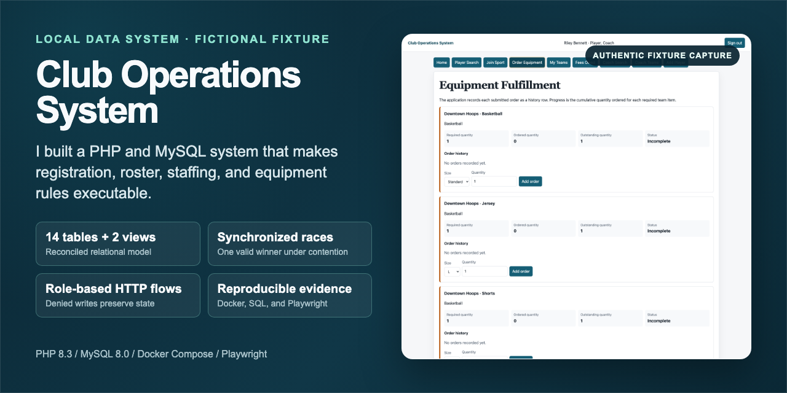
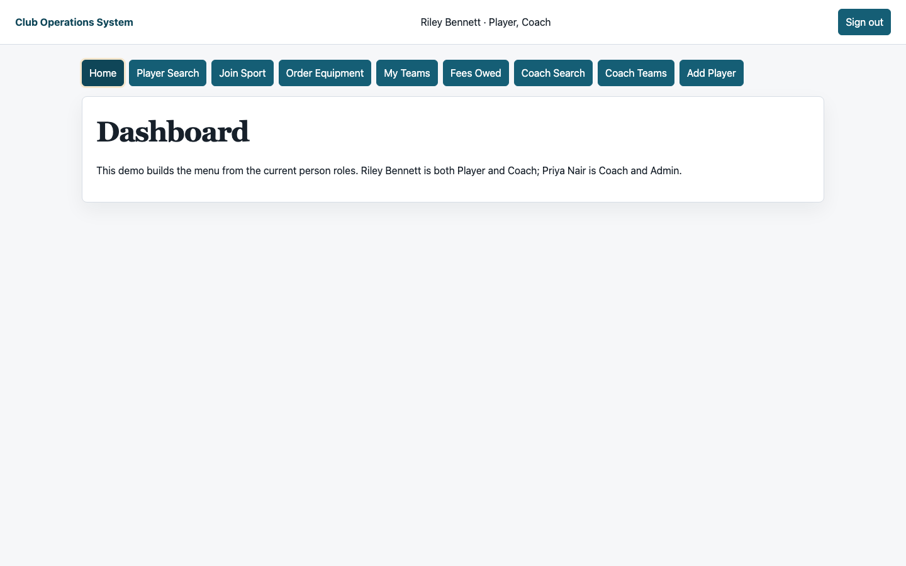

# Club Operations System

Welcome to Club Operations System. I built it to examine a practical systems question: can registration, staffing, roster-capacity, and equipment-history rules remain correct when requests are invalid or writes arrive at the same time?

## Abstract

Club Operations System is a local PHP 8.3 and MySQL 8.0 reference system for a fictional sports program. It places core rules in relational constraints, indexes, triggers, views, and least-privilege grants, then exercises those rules through role-aware application flows. Synchronized SQL races test final-slot, head-coach, and uniform-number contention; HTTP suites test authorization and state preservation; Playwright captures authentic fixture screens and checks accessibility and reflow. The repository includes a schema-backed ERD, reproducible evidence commands, and deterministic fictional data. Its static evidence walkthrough is hosted on GitHub Pages; the PHP/MySQL application remains local and is not operated as a production service. The project is not affiliated with Liverpool FC or any real organization.



The preview is built from an authenticated local fixture capture. Its source and regeneration path are recorded in [`docs/SOCIAL_PREVIEW.md`](docs/SOCIAL_PREVIEW.md).

## 90-second guide

Open the [static evidence walkthrough](https://mahmmodabuhani.github.io/club-operations-system/), hosted on GitHub Pages, to choose among four evidence scenarios. The page is an interactive evidence layer, not the live PHP/MySQL application. Use the paths below for direct source inspection, or run `npm run walkthrough:serve` to inspect the same artifact locally.

| Time | Follow the evidence |
|---|---|
| 0-15 seconds | Choose one current path: [`Role authorization`](tests/http/roles.sh), [`Roster concurrency`](tests/sql/concurrency.sh), [`Equipment fulfillment`](tests/http/fulfillment.sh), or [`Invariant handling`](docs/INVARIANTS.md). Scan the full [`relational model`](docs/erd.svg) for context. |
| 15-35 seconds | Inspect the capacity trigger in [`sql/01_schema.sql`](sql/01_schema.sql), the synchronized races in [`tests/sql/concurrency.sh`](tests/sql/concurrency.sh), and the role denials in [`tests/http/roles.sh`](tests/http/roles.sh). |
| 35-55 seconds | Open the authentic [`interface evidence`](docs/SCREENSHOTS.md) and its [`visual hash ledger`](docs/VISUAL_HASHES.md). |
| 55-75 seconds | Review the complete [`verification workflow`](.github/workflows/ci.yml), then run `make verify` and `make verify-image` locally. |
| 75-90 seconds | Check the [`data and rights contract`](docs/DATA.md), [`security policy`](SECURITY.md), and [limits](#limits-data-rights-and-security). |

To reproduce the complete local check, run `make verify`. The command rebuilds isolated databases and exercises schema rules, contention, application authorization, negative mutations, and automated accessibility checks.

## What the system protects

| Domain rule | Enforcement | Executable proof |
|---|---|---|
| Players must register for a sport before joining its teams | Composite foreign key | [`tests/sql/invariants.sh`](tests/sql/invariants.sh) and [`tests/http/roles.sh`](tests/http/roles.sh) |
| Coaches must be eligible for the sport they staff | Composite foreign key plus application feedback | [`sql/01_schema.sql`](sql/01_schema.sql) and [`tests/http/roles.sh`](tests/http/roles.sh) |
| A roster cannot exceed its sport capacity | Atomic trigger, protected counter, and least-privilege grants | [`tests/sql/concurrency.sh`](tests/sql/concurrency.sh) and [`sql/04_app_grants.sh`](sql/04_app_grants.sh) |
| A team has at most one head coach | Generated key plus unique index | [`tests/sql/concurrency.sh`](tests/sql/concurrency.sh) |
| A non-null uniform number is unique within a team | Composite unique index | [`tests/sql/invariants.sh`](tests/sql/invariants.sh) |
| Equipment orders retain history and accumulate toward fulfillment | Restrictive foreign key plus derived view | [`tests/http/fulfillment.sh`](tests/http/fulfillment.sh) and [`demo/query_outputs.md`](demo/query_outputs.md) |
| HTTP mutations require the intended role, ownership, method, and CSRF token | Route map, session checks, authorization, and CSRF validation | [`tests/http/security.sh`](tests/http/security.sh) and [`tests/http/roles.sh`](tests/http/roles.sh) |

Database guarantees apply to ordinary writes through the `sportlfc` runtime principal. The administrative root account used to rebuild fixtures keeps schema authority. [`docs/INVARIANTS.md`](docs/INVARIANTS.md) states this boundary rule by rule.

## Core methods

- **Relational modeling:** [`sql/01_schema.sql`](sql/01_schema.sql) defines 14 base tables, 2 derived views, composite relationships, checks, indexes, and triggers. [`docs/erd.mmd`](docs/erd.mmd) is the locked Mermaid source for the accessible [`docs/erd.svg`](docs/erd.svg).
- **Integrity under contention:** [`tests/sql/concurrency.sh`](tests/sql/concurrency.sh) coordinates two sessions at a shared barrier and proves exactly one valid winner for a final roster slot, head-coach assignment, and uniform number.
- **Least-privilege application access:** [`sql/04_app_grants.sh`](sql/04_app_grants.sh) limits the runtime principal, while [`web/src/repository.php`](web/src/repository.php) maps only the named roster-capacity database signal to specific user feedback.
- **State-safe authorization:** [`web/public/index.php`](web/public/index.php) and [`web/src/bootstrap.php`](web/src/bootstrap.php) enforce methods, roles, ownership, session rotation, and cross-site request forgery protection. The HTTP suites confirm rejected requests do not alter data.
- **Layered verification:** [`scripts/verify.sh`](scripts/verify.sh) orders static checks, locked dependencies, SQL tests, synchronized races, role workflows, and browser accessibility tests so each stage starts from an isolated fixture.

## Working familiarity

- **Docker and supply-chain controls:** [`docker-compose.yml`](docker-compose.yml) keeps MySQL on the application network, container images use immutable digests, and [`scripts/verify_image_manifest.sh`](scripts/verify_image_manifest.sh) checks both AMD64 and ARM64 manifests for the pinned MySQL image.
- **Accessible interface testing:** [`tests/e2e/accessibility.spec.js`](tests/e2e/accessibility.spec.js) runs axe checks on four pages, confirms visible keyboard focus, and checks 320 CSS-pixel reflow.
- **Evidence automation:** [`scripts/capture_evidence.sh`](scripts/capture_evidence.sh) rebuilds a fresh fixture and captures the authenticated screens catalogued in [`docs/SCREENSHOTS.md`](docs/SCREENSHOTS.md).
- **Data quality and reporting:** [`sql/03_data_quality_checks.sql`](sql/03_data_quality_checks.sql) reconciles the release seed, and [`demo/query_outputs.md`](demo/query_outputs.md) records deterministic analytics output from the same relational model.
- **Portable release checks:** [`scripts/scan_public_surface.mjs`](scripts/scan_public_surface.mjs) uses Node standard-library modules to check public copy, local links, image files, schema-to-ERD agreement, and private-path or institutional-email residue.
- **Workflow automation:** [`.github/workflows/ci.yml`](.github/workflows/ci.yml) uses SHA-pinned actions, read-only repository permissions, concurrency cancellation, and a bounded timeout. It is configured to run the complete verification command on pushes and pull requests.

## Run it locally

### Prerequisites

- Docker Desktop with Docker Compose
- Node.js 22 or newer and npm

Run the complete verification:

```bash
make verify
make verify-image
```

Start the application:

```bash
cp .env.example .env
make up
```

Open <http://localhost:8080>. Every seeded account uses the local-only password `demo123`.

| Login | Roles | Useful workflow |
|---|---|---|
| `james.walker@example.test` | Player | Team and authorization flow |
| `mike.torres@example.test` | Coach | Coach-owned roster flow |
| `priya.nair@example.test` | Coach, Admin | Staffing and analytics |
| `morgan.reed@example.test` | Admin | Administration |
| `riley.bennett@example.test` | Player, Coach | Overlapping roles and cumulative equipment status |

Stop the containers with `make down`.

## Evidence



`make evidence` generates this capture and the other documented screens from a freshly seeded local Docker application. Screenshots show visible application states. The SQL and HTTP suites provide the rejection, state-preservation, and race evidence.

| Evidence state | Current meaning |
|---|---|
| Local verification | [`docs/VALIDATION.md`](docs/VALIDATION.md) records the dated environment, commands, and outcomes. |
| Generated artifacts | [`docs/SCREENSHOTS.md`](docs/SCREENSHOTS.md), [`docs/SOCIAL_PREVIEW.md`](docs/SOCIAL_PREVIEW.md), and [`docs/erd.svg`](docs/erd.svg) each have a source and regeneration path. |
| Continuous integration | [`.github/workflows/ci.yml`](.github/workflows/ci.yml) defines the complete verification job for pushes and pull requests; [GitHub Actions history](https://github.com/MahmmodAbuhani/club-operations-system/actions/workflows/ci.yml) records hosted outcomes by commit. |
| Static deployment | The [interactive evidence walkthrough](https://mahmmodabuhani.github.io/club-operations-system/) is hosted by GitHub Pages from `main` `/docs`. The PHP/MySQL application remains local and is not a hosted service. |
| Production operation | No production users, real data, reliability record, or incident-response record exists. |

## Architecture

```text
Browser and HTTP tests
          |
PHP 8.3 with Apache
  routes, sessions, CSRF, role authorization
          |
PDO prepared statements
          |
MySQL 8.0
  foreign keys, unique indexes, checks, triggers, views
```

The application receives ordinary data access through the limited runtime principal. Administrative credentials exist only for local fixture setup and schema verification.

## Limits, data, rights, and security

- **Fictional data:** [`sql/02_seed.sql`](sql/02_seed.sql) is a deterministic, hand-authored fixture. Names are demonstration identities, email addresses use `.test`, and phone numbers use fictional 555 values. [`docs/DATA.md`](docs/DATA.md) records the full data contract.
- **Local application:** The PHP/MySQL application does not collect payments, send messages, manage real minors' data, or expose a hosted service. Set `SPORTLFC_COOKIE_SECURE=1` only when serving it through HTTPS.
- **Accessibility boundary:** Automated checks do not replace a screen-reader pass, 400 percent zoom inspection, or a full keyboard walkthrough. These manual checks remain separate from the executable suite.
- **Security reporting:** When the repository's Security tab offers **Report a vulnerability**, use that private form. Do not place undisclosed security details, credentials, or real personal data in a public issue. See [`SECURITY.md`](SECURITY.md).
- **Rights:** The fixture, documentation, Mermaid source, generated ERD, deterministic outputs, and local-fixture screenshots are repository-authored material covered by the repository license. No trademark or real-club affiliation rights are asserted or granted.

## License

Unless a file states otherwise, the [MIT License](LICENSE) applies to repository-authored code, documentation, fictional fixtures, generated evidence, and screenshots. Third-party dependencies retain their own licenses.

## Intended use

Club Operations System is intended for inspection of relational integrity, concurrency behavior, least-privilege access, and role-aware application boundaries. The static walkthrough is deployed as an evidence layer; the PHP/MySQL application is not a deployed service or evidence of production operation. Start with the [`invariant matrix`](docs/INVARIANTS.md), then run `make verify` to reproduce the executable checks against a fresh fictional fixture.
