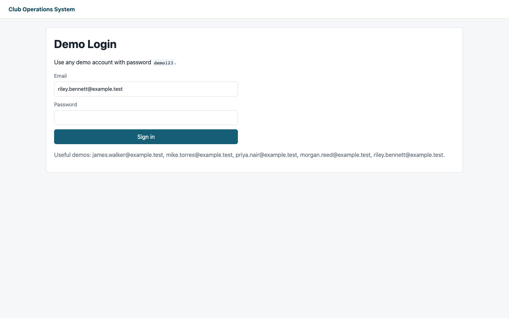
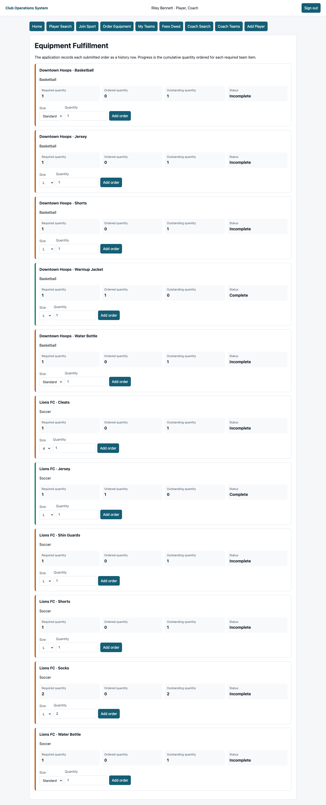
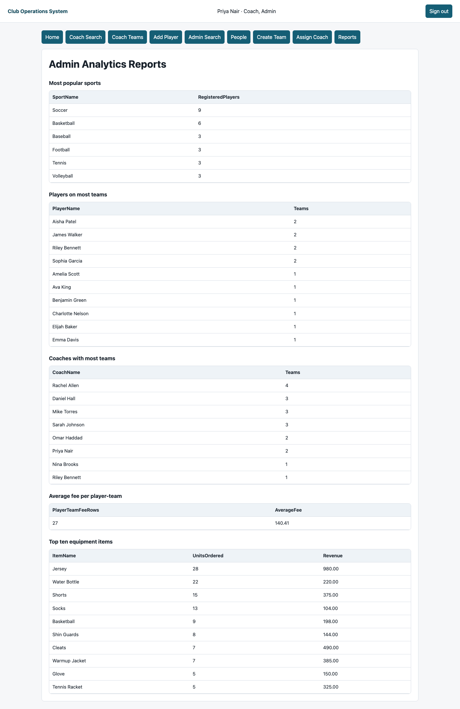

# Verified interface evidence

These screenshots are generated from a freshly seeded Docker Compose application by `scripts/capture_evidence.sh`. Each image is tied to a tested workflow.

## Login and local-demo boundary

## Overlapping roles

Riley Bennett is the fictional fixture with both Player and Coach roles. The dashboard shows both navigation sets for that authenticated identity; the HTTP suites provide the authorization and denial evidence.

## Cumulative equipment fulfillment

The player view reports required, ordered, outstanding, and completion status. Each submitted application order adds a history row; no single row must satisfy the whole requirement.

## Administrator analytics

The reports page displays queries derived from the same constrained relational model used by the role workflows.

Screenshots record visible seeded states, not security or concurrency guarantees. Run `make verify` and inspect `tests/sql` and `tests/http` for executable rejection, state-preservation, and race evidence.

## Social preview

The social preview is composed from the equipment capture above. Its fixed build path and local-only boundary are documented in [`SOCIAL_PREVIEW.md`](SOCIAL_PREVIEW.md).

The checked-in visual hashes are recorded in [`VISUAL_HASHES.md`](VISUAL_HASHES.md).
